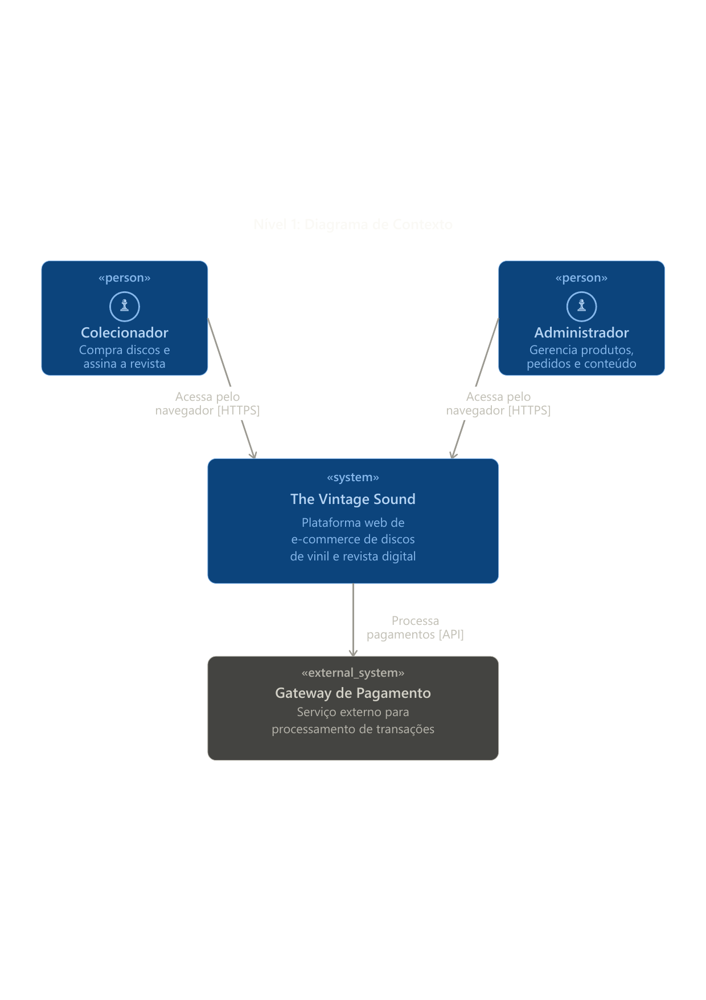
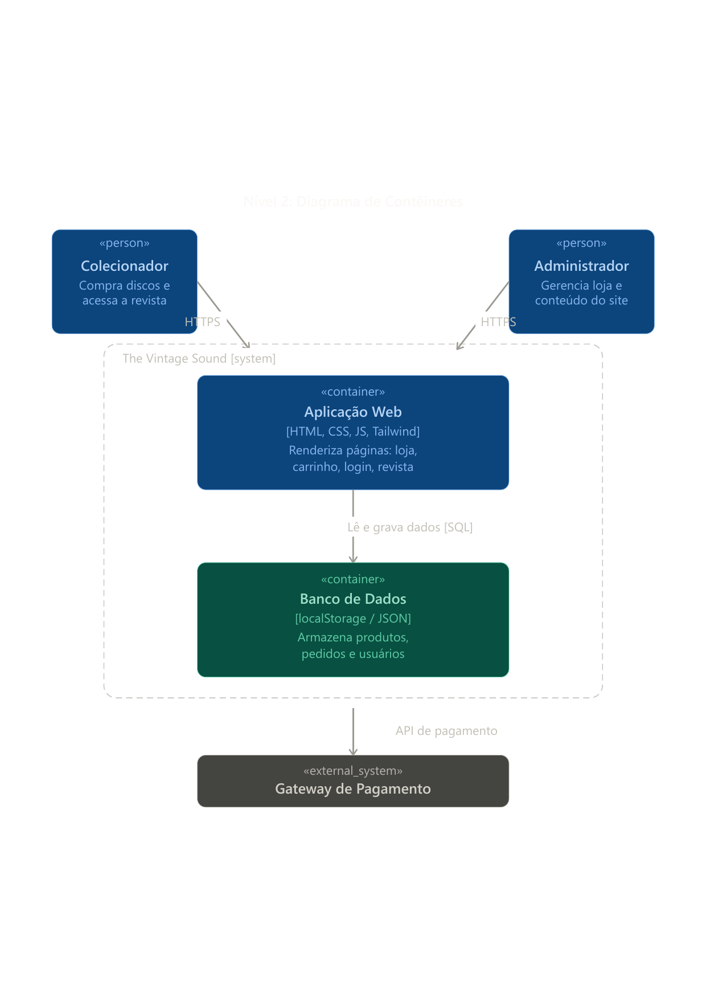
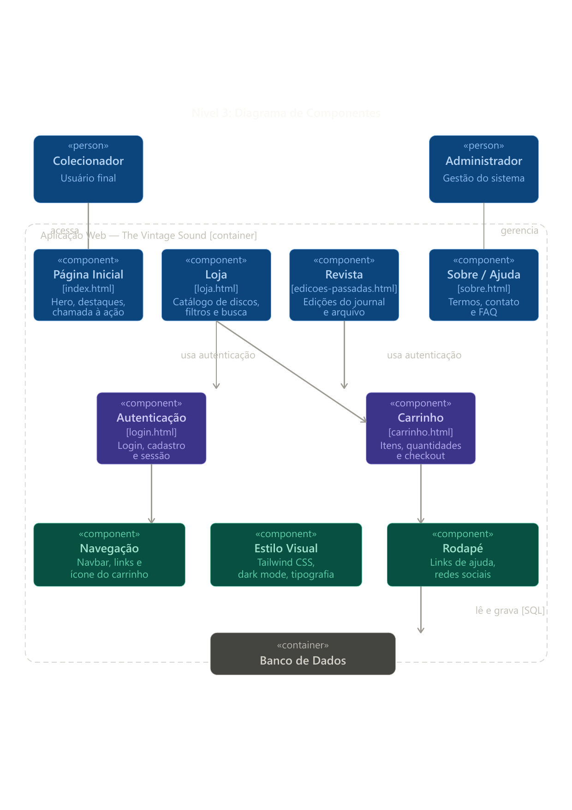
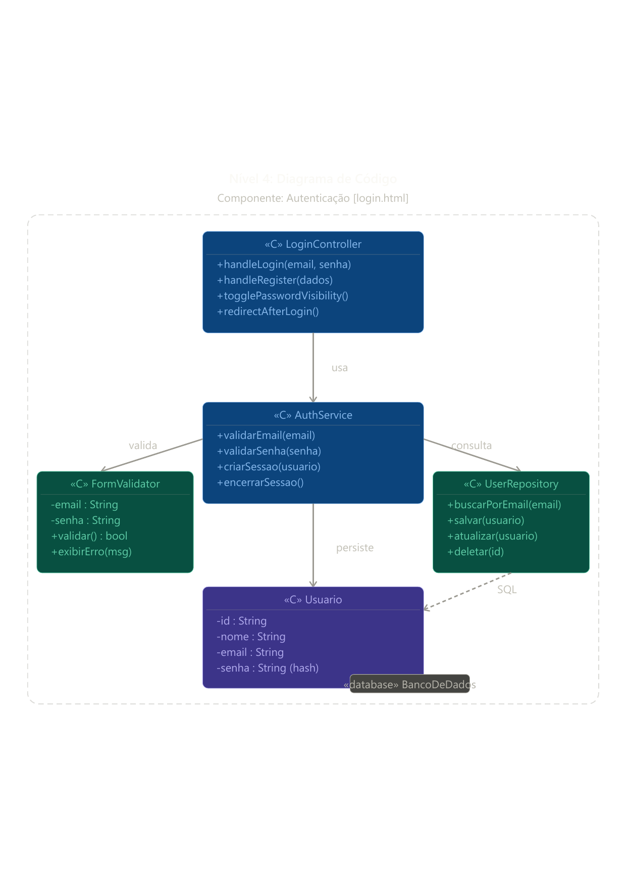

# Clube de Assinatura de Vinil

**Disciplina:** Programação WEB  
**Professor:** Luiz Carlos Camargo, PhD.  
**Alunos:** William (Front-end) e Pedro Israel (Back-end)

---

## 1. Domínio do Problema (Escopo)

O projeto consiste em desenvolver uma aplicação web para um serviço de assinatura de discos de vinil. A plataforma permitirá que usuários se cadastrem, gerenciem sua assinatura e recebam mensalmente um disco de vinil selecionado.

O conceito é criar uma experiência de usuário limpa, minimalista e intuitiva, onde o foco está na descoberta musical e no colecionismo. A cada mês, um novo disco será anunciado no site, e os assinantes ativos o receberão em casa.

### 1.1. Requisitos Funcionais (RF)

- **RF01:** O sistema deve permitir que um novo usuário se cadastre na plataforma, fornecendo dados como nome, e-mail, senha e endereço de entrega.
- **RF02:** O sistema deve permitir que um usuário autenticado gerencie os dados de sua conta (ex: alterar senha, atualizar endereço).
- **RF03:** O sistema deve exibir o disco do mês atual na página principal.
- **RF04:** O sistema deve permitir que um usuário realize a assinatura do serviço, fornecendo dados de pagamento.
- **RF05:** O sistema deve ter uma área administrativa para cadastrar o "disco do mês".
- **RF06:** O sistema deve processar a lógica de envio do disco para todos os assinantes ativos na primeira semana do mês (simulação).

### 1.2. Requisitos Não-Funcionais (RNF)

- **RNF01:** A interface do usuário deve ser limpa, minimalista e responsiva (adaptável a desktops e celulares).
- **RNF02:** A aplicação deve ser segura, protegendo os dados dos usuários e as transações.
- **RNF03:** O back-end deve ser construído como uma API RESTful para desacoplar a lógica do front-end.
- **RNF04:** O sistema deve ser performático, com tempos de resposta rápidos para as requisições do usuário.

---

## 2. Tecnologias Utilizadas

A escolha das tecnologias foi baseada na familiaridade da equipe e nos requisitos da disciplina, buscando ferramentas modernas e eficientes para o desenvolvimento web.

| Camada | Tecnologia | Justificativa |
| :--- | :--- | :--- |
| **Front-end** | `HTML`, `CSS`, `JavaScript` | **HTML** será a base para estruturar o conteúdo de forma semântica e acessível. A escolha se dá pela familiaridade do desenvolvedor e por ser a tecnologia fundamental da web. **CSS** e **JavaScript** serão usados para estilização e interatividade, criando a experiência minimalista desejada. |
| **Back-end** | `Python` com `FastAPI` | **Python** é uma linguagem versátil e de alta produtividade. O framework **FastAPI** foi escolhido por sua alta performance, documentação automática de APIs (Swagger UI) e por facilitar a criação de APIs RESTful robustas e rápidas, o que atende perfeitamente ao nosso RNF03. |
| **Banco de Dados** | `SQLite` (inicialmente) | Para a fase inicial do projeto, `SQLite` é ideal por ser simples, leve e não exigir um servidor dedicado. Ele atende às necessidades de um CRUD básico e pode ser facilmente substituído por um banco de dados mais robusto (como PostgreSQL) no futuro, se necessário. |
| **Controle de Versão** | `Git` e `GitLab` | Conforme solicitado na disciplina, `Git` será usado para o controle de versão do código-fonte, e o `GitLab` para hospedar o repositório, gerenciar o projeto e, futuramente, configurar o pipeline de CI/CD. |

---

## 3. Organização de Tarefas (Trello)

Para organizar o desenvolvimento, utilizaremos um quadro no Trello. A divisão inicial de responsabilidades está definida da seguinte forma:

**William (Front-end):**
- [ ] Estruturar as páginas principais com HTML (Home, Login, Cadastro, Área do Assinante).
- [ ] Estilizar as páginas com CSS para garantir o design minimalista e responsivo.
- [ ] Implementar a lógica de front-end com JavaScript para consumir a API do back-end.

**Pedro Israel (Back-end):**
- [ ] Modelar o banco de dados (tabelas de usuários, assinaturas, discos).
- [ ] Desenvolver a API RESTful com FastAPI (endpoints para CRUD de usuários, autenticação, etc.).
- [ ] Implementar a lógica de negócio para o sistema de assinaturas.

---

## 4. Arquitetura do Sistema — Modelo C4

O modelo C4 é uma abordagem para documentar a arquitetura de software em quatro níveis de abstração progressiva: **Contexto**, **Contêineres**, **Componentes** e **Código**. Cada nível aprofunda o detalhamento do anterior, permitindo que diferentes públicos (gestores, desenvolvedores, novos integrantes) entendam o sistema na granularidade adequada ao seu papel.

---

### 4.1. Nível 1 — Diagrama de Contexto

> **O que é?** O nível mais alto de abstração. Mostra o sistema como uma "caixa preta" e responde à pergunta: *quem usa o sistema e com o que ele se comunica externamente?*



#### Visão Geral

O diagrama de contexto apresenta o sistema **The Vintage Sound** e suas relações com os atores e sistemas externos. Neste nível, não há detalhes de implementação — o objetivo é entender o ecossistema em que a plataforma está inserida.

#### Atores e Sistemas

| Elemento | Tipo | Descrição |
| :--- | :--- | :--- |
| **Colecionador** | Pessoa (Usuário) | Usuário final da plataforma. Acessa o sistema pelo navegador via HTTPS para comprar discos de vinil e assinar a revista digital. |
| **Administrador** | Pessoa (Usuário) | Responsável pela gestão interna. Acessa o sistema pelo navegador via HTTPS para gerenciar produtos, pedidos e conteúdo publicado. |
| **The Vintage Sound** | Sistema Principal | A plataforma web central do projeto — ponto de entrada para todas as interações de usuários e administradores. |
| **Gateway de Pagamento** | Sistema Externo | Serviço terceirizado responsável pelo processamento seguro das transações financeiras. A comunicação ocorre via API (HTTPS). |

#### Fluxo de Comunicação

```
Colecionador      ──[HTTPS]──> The Vintage Sound
Administrador     ──[HTTPS]──> The Vintage Sound
The Vintage Sound ──[API]────> Gateway de Pagamento
```

---

### 4.2. Nível 2 — Diagrama de Contêineres

> **O que é?** Detalha o interior do sistema principal, mostrando as grandes "partes" que o compõem — aplicações, bancos de dados, serviços — e como elas se comunicam entre si.



#### Visão Geral

O diagrama de contêineres expande a caixa "The Vintage Sound" e revela dois contêineres principais: a **Aplicação Web** (front-end) e o **Banco de Dados** (persistência). Ambos colaboram para atender às requisições dos usuários.

#### Contêineres

| Contêiner | Tecnologia | Responsabilidade |
| :--- | :--- | :--- |
| **Aplicação Web** | HTML, CSS, JavaScript, Tailwind CSS | Renderiza todas as páginas do sistema: loja de discos, carrinho de compras, login/cadastro e área da revista. É o ponto de contato direto com o navegador do usuário. |
| **Banco de Dados** | localStorage / JSON | Persiste os dados da aplicação: catálogo de produtos, pedidos realizados e informações de usuários. A comunicação ocorre via leitura e gravação de dados (SQL simulado via localStorage). |

#### Fluxo de Comunicação

```
Colecionador  ──[HTTPS]──────────────> Aplicação Web
Administrador ──[HTTPS]──────────────> Aplicação Web
Aplicação Web ──[lê e grava / SQL]──> Banco de Dados
Aplicação Web ──[API de pagamento]──> Gateway de Pagamento
```

---

### 4.3. Nível 3 — Diagrama de Componentes

> **O que é?** Detalha o interior de um contêiner específico, mostrando os componentes (módulos, páginas, serviços internos) que o compõem e como eles se relacionam.



#### Visão Geral

O diagrama de componentes expande o contêiner **Aplicação Web** e mapeia todas as páginas e módulos compartilhados que formam o sistema. Cada componente corresponde a um arquivo HTML ou a um módulo reutilizável de interface.

#### Componentes de Página

| Componente | Arquivo | Descrição |
| :--- | :--- | :--- |
| **Página Inicial** | `index.html` | Página de entrada da plataforma. Contém a seção hero, destaques do mês e chamadas à ação para compra/assinatura. |
| **Loja** | `loja.html` | Catálogo completo de discos de vinil disponíveis, com recursos de filtros por gênero/artista e campo de busca. |
| **Revista** | `edicoes-passadas.html` | Arquivo digital das edições da revista. Exibe edições passadas do journal e permite acesso ao conteúdo editorial. |
| **Sobre / Ajuda** | `sobre.html` | Página institucional com termos de uso, informações de contato e FAQ para suporte ao usuário. |
| **Autenticação** | `login.html` | Gerencia o fluxo de login, cadastro de novos usuários e controle de sessão ativa. Utilizado pela Loja e pela Revista para restringir acesso a usuários autenticados. |
| **Carrinho** | `carrinho.html` | Exibe os itens adicionados, permite ajuste de quantidades e conduz o usuário ao checkout e pagamento. |

#### Componentes Compartilhados

| Componente | Descrição |
| :--- | :--- |
| **Navegação** | Barra de navegação global (navbar) com links para as seções principais e ícone de acesso rápido ao carrinho. |
| **Estilo Visual** | Módulo de design baseado em Tailwind CSS. Define o tema visual global: dark mode, tipografia, paleta de cores e espaçamentos. |
| **Rodapé** | Rodapé global com links institucionais de ajuda e ícones de redes sociais. |

---

### 4.4. Nível 4 — Diagrama de Código

> **O que é?** O nível mais detalhado do modelo C4. Mostra a estrutura interna de um componente específico com suas classes, métodos e atributos — equivalente a um diagrama de classes UML.



#### Visão Geral

O diagrama de código detalha a implementação interna do componente **Autenticação** (`login.html`), mapeando as classes JavaScript responsáveis pelo fluxo de login e cadastro de usuários.

#### Classes e Responsabilidades

| Classe | Tipo | Responsabilidade |
| :--- | :--- | :--- |
| **LoginController** | Controller | Classe principal que coordena as ações do usuário na interface. Gerencia os eventos de login, cadastro, visibilidade da senha e redirecionamento pós-autenticação. |
| **AuthService** | Service | Camada de serviço que implementa a lógica de negócio da autenticação. Responsável por validar credenciais, criar e encerrar sessões de usuário. |
| **FormValidator** | Validator | Classe auxiliar de validação de formulários. Encapsula as regras de validação de e-mail e senha, e expõe mensagens de erro para a interface. |
| **UserRepository** | Repository | Camada de acesso a dados. Abstrai as operações de CRUD (buscar, salvar, atualizar, deletar) para a entidade `Usuario` no banco de dados. |
| **Usuario** | Model | Entidade de domínio que representa um usuário do sistema. A senha é armazenada como hash por segurança. |

#### Atributos e Métodos

**`LoginController`**
```
+ handleLogin(email, senha)       → Processa a submissão do formulário de login
+ handleRegister(dados)           → Processa o cadastro de um novo usuário
+ togglePasswordVisibility()      → Alterna a visibilidade do campo de senha
+ redirectAfterLogin()            → Redireciona o usuário após autenticação
```

**`AuthService`**
```
+ validarEmail(email)             → Valida o formato do e-mail
+ validarSenha(senha)             → Valida os critérios mínimos da senha
+ criarSessao(usuario)            → Inicia uma sessão autenticada para o usuário
+ encerrarSessao()                → Encerra a sessão ativa (logout)
```

**`FormValidator`**
```
- email : String
- senha : String
+ validar() : bool                → Executa todas as validações e retorna true/false
+ exibirErro(msg)                 → Renderiza uma mensagem de erro na interface
```

**`UserRepository`**
```
+ buscarPorEmail(email)           → Localiza um usuário pelo e-mail no banco de dados
+ salvar(usuario)                 → Persiste um novo usuário
+ atualizar(usuario)              → Atualiza os dados de um usuário existente
+ deletar(id)                     → Remove um usuário pelo ID
```

**`Usuario` (Model)**
```
- id     : String
- nome   : String
- email  : String
- senha  : String (hash)          → Senha nunca armazenada em texto plano
```

#### Fluxo de Execução (Login)

```
LoginController.handleLogin(email, senha)
  └─> AuthService.validarEmail(email)
        └─> FormValidator.validar()
  └─> AuthService.validarSenha(senha)
        └─> FormValidator.validar()
  └─> UserRepository.buscarPorEmail(email)  ──[SQL]──> BancoDeDados
  └─> AuthService.criarSessao(usuario)
  └─> LoginController.redirectAfterLogin()
```

---

## 5. Resumo da Arquitetura

```
[Colecionador]  ──HTTPS──> [Aplicação Web] ──SQL──> [Banco de Dados]
[Administrador] ──HTTPS──> [Aplicação Web]
                           [Aplicação Web] ──API──>  [Gateway de Pagamento]

Aplicação Web:
  ├── index.html                  (Página Inicial)
  ├── loja.html                   (Loja de Discos)
  ├── edicoes-passadas.html       (Revista)
  ├── sobre.html                  (Sobre / Ajuda)
  ├── login.html                  (Autenticação)
  │     ├── LoginController
  │     ├── AuthService
  │     ├── FormValidator
  │     ├── UserRepository
  │     └── Usuario (Model)
  └── carrinho.html               (Carrinho / Checkout)
```
